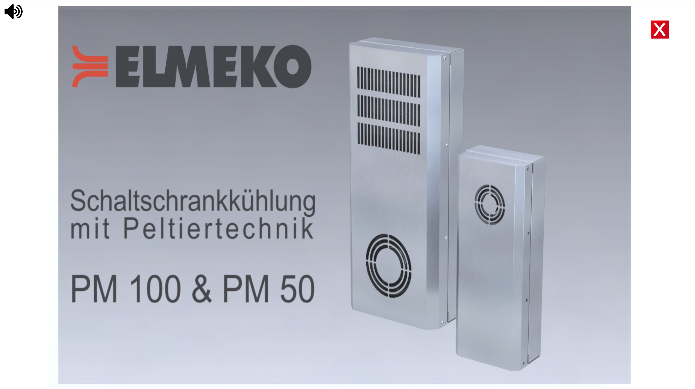

# ELMEKO Virtual Exhibition

Since it was difficult or even impossible to visit trade fairs in times of the corona virus, I developed a virtual trade fair stand for the [website of the ELMEKO GmbH & Co. KG company](https://www.elmeko.de/en/home).

    Key aspects:

        - Made with Unity-Engine
        - Almost all content can be exchanged on the server. (Texts, video, images)
        - Shows current products and links to various pages of the ELMEKO website

[Visit the virtual trade fair](https://www.elmeko.de/virtueller_messestand/)

# Content

## Overview

This view provides an overview of the entire exhibition stand. All interactive objects are marked with an exclamation mark.

Transition to the [cooling unit PK 150](#cooling-unit-pk-150).

## Cooling unit PK 150

The cooling unit can be rotated with the mouse or finger. On the right-hand side is the most important information and a button that links to the product in the online shop.

## Out-Fit

This object can also be rotated and the ‘Details’ button leads to a detailed product presentation, which can also be called up separately on the website of ELMEKO.
This presentation was also developey by me with the Unity-Engine.

[Visit the Out-Fit presentation](https://www.elmeko.de/Product_Presentation_OutFit/)

## DeltaT

DeltaT is software for determining the right cooling unit or heater for the enclosure.
A click on the laptop leads to this programme.

[Visit DeltaT](https://www.elmeko.de/en/service/calculation-software/)

## Light Selection

The Light Selector was another tool on the ELMEKO website to find suitable lights for the control cabinet.
However, this tool is no longer available.

## News

The latest news is displayed on the wall. A click on this leads to the [news page of the ELMEKO homepage](https://www.elmeko.de/en/news/show-all/).

## Video

A video can be played and paused with one click. This video can be exchanged on the server.

## Stands

The three stands each link to one of the three major categories of the ELMEKO shop.
[Air conditioning](https://www.elmeko.de/en/products/schaltschrank-klimatisierung/), [Lightning](https://www.elmeko.de/en/products/schaltschrank-beleuchtung/) and [Accessories](https://www.elmeko.de/en/products/schaltschrank-zubehor/.)

## Contact

Here you will find links to the various social media platforms and the [contact form](https://www.elmeko.de/en/contact/contact-form) 

